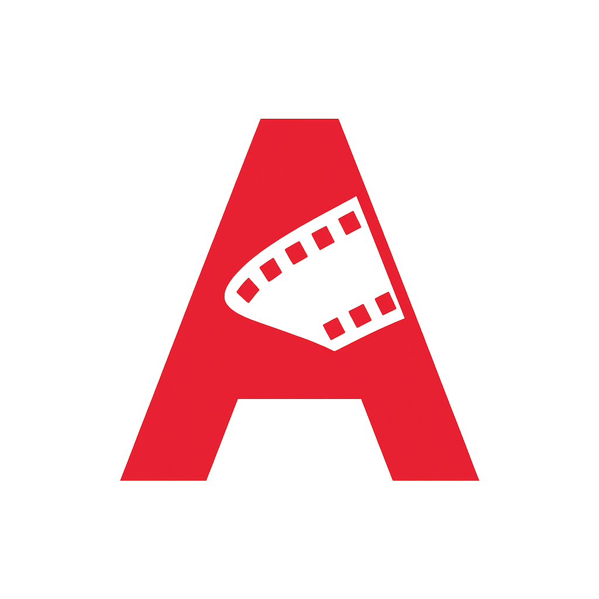

# 🎬 Masterclass: Cómo Construir "CINEFLIX" (Clon de Netflix)
> **Manual Paso a Paso para Entusiastas, Estudiantes y Futuros Programadores.**

  

---

## 📖 1. La Narrativa: El Problema y la Solución

### 🧐 El Problema
Imagina que eres dueño de un cine digital. Tienes miles de películas, pero tus usuarios no saben qué ver. Están abrumados. Necesitas una forma de organizar tus películas por categorías (Acción, Comedia, Terror), mostrarles un avance espectacular cuando elijan una, y recomendarles cosas similares para que no se vayan nunca.

### 💡 La Solución: CINEFLIX
Vamos a construir una aplicación web tipo **Single Page Application (SPA)**. No recargará la página cada vez que hagas clic. Será fluida, hermosa y oscura, como una sala de cine.

### 🎯 Objetivos de Aprendizaje
Al terminar este tutorial, habrás aprendido:
1.  **Consumo de APIs:** Cómo pedir datos a un servidor externo (TMDB).
2.  **DOM Manipulation:** Cómo crear HTML desde JavaScript automáticamente.
3.  **CSS Grid & Flexbox:** Cómo maquetar como un profesional.
4.  **Lógica de UI:** Modales, carruseles infinitos y sistemas de filtrado.

---

## 🛠 2. Tecnologías y Herramientas

No necesitas instalar programas pesados. Usaremos estándares web:

*   **HTML5:** El esqueleto (huesos).
*   **CSS3:** La piel y el maquillaje (estilos).
*   **JavaScript (ES6):** El cerebro (lógica).
*   **Bootstrap 5:** Un ayudante para no escribir tanto CSS básico.
*   **Vite:** Nuestro motor para ver los cambios al instante.

---

## 🚀 3. Instalación y Configuración Inicial

### Paso 1: Preparar el Terreno
Necesitas tener instalado **Node.js**. Si no lo tienes, descárgalo de su web oficial.

1.  Abre tu terminal (o consola de comandos).
2.  Clona este proyecto (o crea una carpeta nueva):
    ```bash
    git clone https://github.com/JUANCITOPENA/CINEFLIX.git
    cd CINEFLIX
    ```
3.  Instala las dependencias necesarias:
    ```bash
    npm install
    ```

### Paso 2: La Llave Maestra (API Key)
Necesitamos permiso para acceder a la base de datos de películas.
1.  Regístrate gratis en [TheMovieDB.org](https://www.themoviedb.org/).
2.  Ve a Configuración -> API y crea una Key.
3.  En la raíz de tu proyecto, crea un archivo llamado `.env`:
    ```env
    VITE_API_KEY=tu_clave_super_secreta_aqui
    ```

---

## 💻 4. El Código Explicado (Paso a Paso)

A continuación, te muestro los archivos completos. Puedes copiarlos y pegarlos, pero lee las explicaciones para entender la magia.

### 📄 A. El Esqueleto (`index.html`)

Aquí definimos la estructura. Observa cómo usamos clases de Bootstrap (`container`, `row`, `col`) y nuestros propios IDs.

*   **Navbar:** La barra superior que se queda pegada.
*   **Hero:** La imagen gigante principal.
*   **Carruseles:** Los contenedores donde irán las películas.
*   **Modal:** La ventana emergente con el trailer y detalles.

```html
<!DOCTYPE html>
<html lang="es" data-bs-theme="dark">
<head>
    <meta charset="UTF-8">
    <meta name="viewport" content="width=device-width, initial-scale=1.0">
    <title>Cineflix</title>
    <!-- Bootstrap y Iconos -->
    <link href="https://cdn.jsdelivr.net/npm/bootstrap@5.3.3/dist/css/bootstrap.min.css" rel="stylesheet">
    <link rel="stylesheet" href="https://cdn.jsdelivr.net/npm/bootstrap-icons@1.11.3/font/bootstrap-icons.min.css">
    <!-- Google Fonts -->
    <link href="https://fonts.googleapis.com/css2?family=Roboto:wght@400;500;700;900&display=swap" rel="stylesheet">
    <link rel="stylesheet" href="style.css">
</head>
<body>
    <!-- BARRA DE NAVEGACIÓN -->
    <nav id="navbar" class="navbar navbar-expand-lg navbar-dark navbar-sticky">
        <div class="container-fluid">
            <a class="navbar-brand" href="#"></a>
            <div class="d-flex align-items-center ms-auto">
                <input id="search-input" class="form-control me-2" type="search" placeholder="Buscar...">
                <div id="search-results" class="list-group position-absolute" style="top: 60px; right: 10px; width: 300px; z-index: 2000;"></div>
            </div>
        </div>
    </nav>

    <!-- PANTALLA PRINCIPAL -->
    <div id="main-app-screen">
        <div id="home-page">
            <header id="hero-section">
                 <div class="skeleton skeleton-hero h-100"></div>
                 <div class="hero-content-wrapper d-none">
                    <div class="container-fluid hero-content">
                        <h1 id="hero-title" class="hero-title"></h1>
                        <p id="hero-description" class="hero-description my-4"></p>
                        <div class="d-flex align-items-center gap-3 hero-buttons">
                            <button id="hero-play-btn" class="btn btn-light btn-lg"><i class="bi bi-play-fill"></i> Reproducir</button>
                            <button id="hero-info-btn" class="btn btn-secondary btn-lg bg-opacity-50"><i class="bi bi-info-circle"></i> Más información</button>
                        </div>
                    </div>
                 </div>
            </header>
            <!-- AQUÍ SE INYECTAN LAS CATEGORÍAS -->
            <main id="category-sections" class="container-fluid"></main>
        </div>
    </div>

    <!-- MODAL DE DETALLES (ESTILO NETFLIX) -->
    <div class="modal fade" id="detail-modal" tabindex="-1" aria-hidden="true">
        <div class="modal-dialog modal-dialog-centered modal-lg">
            <div class="modal-content bg-dark text-white">
                <div class="modal-body p-0">
                    <div id="modal-content-loader" class="text-center p-5">Loading...</div>
                    <div id="modal-content-container" class="d-none">
                        <!-- IMAGEN CABECERA -->
                        <div class="modal-body-content position-relative">
                            
                            <div class="modal-backdrop-overlay" style="position: absolute; inset: 0; background: linear-gradient(to top, #141414, transparent);"></div>
                        </div>
                        <!-- INFO -->
                        <div class="p-4">
                            <h1 id="modal-title" class="fw-bold mb-3"></h1>
                            <div class="row">
                                <div class="col-md-8">
                                    <div class="d-flex gap-2 mb-3 metadata-line">
                                        <span class="text-success fw-bold">98% coincidencia</span>
                                        <span id="modal-year"></span>
                                        <span id="modal-runtime"></span>
                                    </div>
                                    <p id="modal-overview"></p>
                                </div>
                                <div class="col-md-4 text-small">
                                    <div><span class="text-secondary">Elenco:</span> <span id="modal-cast"></span></div>
                                    <div><span class="text-secondary">Géneros:</span> <span id="modal-genres-list"></span></div>
                                </div>
                            </div>
                            <!-- TRAILER -->
                            <div id="modal-trailer-container" class="mt-4"></div>
                            <!-- RECOMENDACIONES -->
                            <div class="mt-5 border-top border-secondary pt-4">
                                <h5>Más títulos similares</h5>
                                <div id="modal-recommendations-grid" class="row g-3"></div>
                            </div>
                            <!-- ACERCA DE -->
                            <div class="mt-5 border-top border-secondary pt-4">
                                <h5>Acerca de <span id="modal-about-title"></span></h5>
                                <div id="modal-about-content" class="about-grid"></div>
                            </div>
                        </div>
                    </div>
                </div>
            </div>
        </div>
    </div>
    
    <script src="https://cdn.jsdelivr.net/npm/bootstrap@5.3.3/dist/js/bootstrap.bundle.min.js"></script>
    <script type="module" src="script.js"></script>
</body>
</html>
```

### 🎨 B. El Estilo (`style.css`)

Aquí definimos el "look & feel".
*   **Variables:** Colores que usamos mucho (Rojo Netflix, Negro fondo).
*   **Carruseles:** La magia del scroll horizontal oculto y las flechas que aparecen al hacer hover.
*   **Tarjetas:** Efecto de zoom (`transform: scale`) cuando pasas el mouse.

```css
:root {
    --netflix-red: #E50914;
    --netflix-black: #141414;
}
body { background-color: var(--netflix-black); color: #fff; font-family: 'Roboto', sans-serif; overflow-x: hidden; }

/* CARRUSELES Y FLECHAS DE NAVEGACIÓN */
.category-row { padding: 1rem 0; position: relative; margin-bottom: 1rem; }
.carousel-container { position: relative; padding: 0 4%; }
.movie-carousel { display: flex; overflow-x: auto; scroll-behavior: smooth; scrollbar-width: none; padding: 1rem 0; }
.movie-carousel::-webkit-scrollbar { display: none; }

/* FLECHAS */
.carousel-handle {
    position: absolute; top: 0; bottom: 0; width: 4%;
    background: rgba(20,20,20,0.5); border: none; color: #fff;
    z-index: 20; display: flex; align-items: center; justify-content: center;
    opacity: 0; transition: 0.2s; cursor: pointer;
}
.category-row:hover .carousel-handle { opacity: 1; }
.carousel-handle:hover { background: rgba(20,20,20,0.8); }
.handle-left { left: 0; }
.handle-right { right: 0; }

/* TARJETAS (MOVIE CARDS) */
.movie-card {
    flex: 0 0 auto; width: clamp(120px, 18vw, 200px); margin-right: 10px;
    background: #222; border-radius: 4px; overflow: hidden;
    position: relative; transition: transform 0.3s ease, z-index 0.3s;
}
.movie-card:hover { transform: scale(1.15); z-index: 10; }
.movie-card img { width: 100%; aspect-ratio: 2/3; object-fit: cover; }

/* MODAL VIDEO */
#modal-trailer-container iframe {
    width: 100% !important; aspect-ratio: 16/9; border: none; border-radius: 4px;
}

/* RECOMENDACIONES */
.recommendation-card { cursor: pointer; transition: 0.2s; background: #2f2f2f; }
.recommendation-card:hover { transform: scale(1.02); background: #404040; }
.recommendation-img-container img { width: 100%; aspect-ratio: 16/9; object-fit: cover; }
```

### 🧠 C. La Lógica (`script.js`)

Este es el cerebro.
1.  **fetchTMDB:** Función maestra que habla con la API.
2.  **renderCarousels:** Crea las filas, las tarjetas y programa las flechas para moverse.
3.  **openDetailModal:** La joya de la corona. Hace 4 llamadas simultáneas (Info, Video, Créditos, Recomendaciones) y rellena el modal estilo Netflix.

```javascript
document.addEventListener('DOMContentLoaded', () => {
    const API_KEY = import.meta.env.VITE_API_KEY; // Tu llave
    const API_BASE_URL = 'https://api.themoviedb.org/3';
    const IMG_BASE_URL = 'https://image.tmdb.org/t/p/';
    
    const detailModal = new bootstrap.Modal(document.getElementById('detail-modal'));

    // 1. CLIENTE API
    async function fetchTMDB(endpoint, params = {}) {
        const url = new URL(`${API_BASE_URL}/${endpoint}`);
        url.searchParams.append('api_key', API_KEY);
        url.searchParams.append('language', 'es-ES');
        // Magia para pedir params extra
        for (const key in params) url.searchParams.append(key, params[key]);
        try {
            const response = await fetch(url);
            return await response.json();
        } catch (error) { console.error(error); return null; }
    }

    // 2. RENDERIZADOR DE CARRUSELES (CON FLECHAS)
    async function renderCarousels() { 
        const container = document.getElementById('category-sections'); 
        const categories = [ 
            { title: 'Populares', endpoint: 'movie/popular' }, 
            { title: 'Top Series', endpoint: 'tv/top_rated' },
            { title: 'Acción', endpoint: 'discover/movie', params: { with_genres: 28 } }
        ]; 

        for (const [index, category] of categories.entries()) { 
            const row = document.createElement('div'); 
            row.className = 'category-row'; 
            // Inyectamos HTML de flechas y contenedor
            row.innerHTML = `
                <h3 class="category-title" style="margin-left: 4%;">${category.title}</h3>
                <div class="carousel-container group">
                    <button class="carousel-handle handle-left" id="prev-${index}"><i class="bi bi-chevron-left"></i></button>
                    <div class="movie-carousel" id="carousel-${index}">Loading...</div>
                    <button class="carousel-handle handle-right" id="next-${index}"><i class="bi bi-chevron-right"></i></button>
                </div>`; 
            container.appendChild(row); 

            const data = await fetchTMDB(category.endpoint, category.params); 
            if (data?.results) { 
                const carousel = document.getElementById(`carousel-${index}`);
                carousel.innerHTML = data.results.map(createMovieCard).join(''); 
                
                // Lógica de Desplazamiento
                const btnPrev = document.getElementById(`prev-${index}`);
                const btnNext = document.getElementById(`next-${index}`);
                btnPrev.style.display = 'none'; // Ocultar al inicio

                const handleScroll = (dir) => {
                    const amount = carousel.clientWidth * 0.9;
                    carousel.scrollLeft += (dir === 'left' ? -amount : amount);
                };
                
                btnPrev.onclick = () => handleScroll('left');
                btnNext.onclick = () => handleScroll('right');
                
                carousel.onscroll = () => {
                    btnPrev.style.display = carousel.scrollLeft > 50 ? 'flex' : 'none';
                };
            } 
        } 
    }

    // 3. CREADOR DE TARJETAS HTML
    function createMovieCard(item) {
        return `
        <div class="movie-card" onclick="openDetailModal(${item.id}, '${item.title ? 'movie' : 'tv'}')">
            
        </div>`;
    }

    // 4. MODAL DETALLADO (ESTILO NETFLIX)
    window.openDetailModal = async function(id, type) {
        detailModal.show();
        // Carga paralela de datos para velocidad extrema
        const [details, videos, credits, recs] = await Promise.all([
            fetchTMDB(`${type}/${id}`),
            fetchTMDB(`${type}/${id}/videos`),
            fetchTMDB(`${type}/${id}/credits`),
            fetchTMDB(`${type}/${id}/recommendations`)
        ]);

        // Llenar datos básicos
        document.getElementById('modal-title').textContent = details.title || details.name;
        document.getElementById('modal-overview').textContent = details.overview;
        document.getElementById('modal-backdrop').src = `${IMG_BASE_URL}original${details.backdrop_path}`;
        
        // Llenar columnas laterales
        document.getElementById('modal-cast').textContent = credits.cast.slice(0,4).map(c=>c.name).join(', ');
        document.getElementById('modal-genres-list').textContent = details.genres.map(g=>g.name).join(', ');

        // Renderizar Recomendaciones
        const recGrid = document.getElementById('modal-recommendations-grid');
        recGrid.innerHTML = recs.results.slice(0,6).map(r => `
            <div class="col-4">
                <div class="recommendation-card" onclick="openDetailModal(${r.id}, '${type}')">
                    
                    <small class="text-white p-2 d-block">${r.title || r.name}</small>
                </div>
            </div>
        `).join('');
    };

    // INICIAR
    renderCarousels();
});
```

---

## 🏃‍♂️ 5. Ejecutar el Proyecto

Una vez tengas los archivos listos:

1.  En tu terminal, corre:
    ```bash
    npm run dev
    ```
2.  Abre el link que aparece (usualmente `http://localhost:5173`).
3.  **¡Disfruta tu propio Netflix!** 🍿

---

### ❤️ Contribuye
Si encuentras un error o quieres agregar algo (como login real), haz un **Fork** y envíame un **Pull Request**.

Desarrollado con pasión para aprender programación web real.